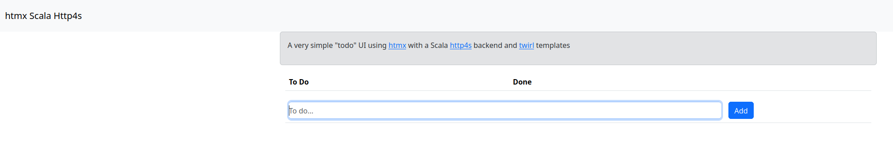

# Scala [http4s](https://http4s.org/) [htmx](https://htmx.org/) Demo

A very simple demonstration of the use of [htmx](https://http4s.org/) with a [http4s](https://http4s.org/) server together 
with [twirl](https://github.com/playframework/twirl) templates.

This application implements the classic 'To Do' application with a database (JDBC) backend. 

## Using this Project

Requirements: [JDK](https://adoptopenjdk.net/?variant=openjdk17) >= 17 and [Sbt](https://maven.apache.org/).

Once Java & sbt are installed, clone this project, and run `sbt run` from the project root.

You should see this line in the console: -
```
2024-01-17 19:50:25.464 INFO  [io-compute-5] n.m.d.HtmxDemoServer - Ember-Server service bound to address: [::]:8080
```

Point your browser to `http://localhost:8080` and you should see the following page: -



## Logging

Change the [logback.xml](src/main/resources/logback.xml) file to see/hide debug messages.

## Database
The code uses an (in memory) h2 database by default. The JDBC connection parameters are stored in [application.properties](src/main/resources/application.properties).


## Details
* The database integration is implemented with [Doobie](https://tpolecat.github.io/doobie/)  a pure functional
JDBC layer for Scala and [Cats](https://typelevel.org/cats-effect/)
* [WebJars](https://www.webjars.org) are used to install and manage Bootstrap, and htmx. More information
on [using WebJars with http4s](https://http4s.org/v0.23/docs/static.html#webjars).
* The project also includes the [sbt-revolver](https://github.com/spray/sbt-revolver) plugin. This means you can use the command `~ reStart` on the sbt commandline and the server will restart on any code change.
